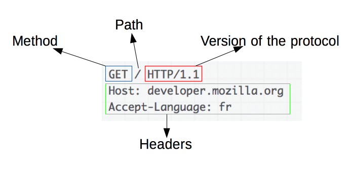

## HTTP
#### 서버와 클라이언트 모델을 따라 데이터를 주고 받기 위한 프로토콜
#### HTTP는 애플리케이션 레벨의 프로토콜로 TCP/IP 위에서 작동한다. HTTP는 상태를 가지고 있지 않는 Stateless 프로토콜이며 Method, Path, Version, Headers, Body 등으로 구성된다.

## HTTPS

#### HyperText Transfer Protocol over Secure Socket Layer, HTTP over TLS, HTTP over SSL, HTTP Secure 등으로 불리는 HTTPS는 HTTP에 데이터 암호화가 추가된 프로토콜이다. HTTPS는 HTTP와 다르게 443번 포트를 사용하며, 네트워크 상에서 중간에 제3자가 정보를 볼 수 없도록 암호화를 지원하고 있다.
#### HTTPS는 대칭키와 비대칭키를 모두 사용하고 있다.

   - 대칭키 암호화
     - 클라이언트와 서버가 동일한 키를 사용해 암호화/복호화를 진행함
    키가 노출되면 매우 위험하지만 연산 속도가 빠름

   - 비대칭키 암호화
     - 1개의 쌍으로 구성된 공개키와 개인키를 암호화/복호화 하는데 사용함
     키가 노출되어도 비교적 안전하지만 연산 속도가 느림

#### 비대칭키는 공개키/개인키 암호화 방식을 이용한다 공개키와 개인키는 서로를 위한 1쌍이다.

- 공개키 암호화: 공개키로 암호화를 하면 개인키로만 복호화할 수 있다. -> 개인키는 나만 가지고 있으므로, 나만 볼 수 있다. 
- 개인키 암호화: 개인키로 암호화하면 공개키로만 복호화할 수 있다. -> 공개키는 모두에게 공개되어 있으므로, 내가 인증한 정보임을 알려 신뢰성을 보장할 수 있다.

## HTTPS의 동작 과정

HTTPS 연결 과정(Hand-Shaking)에서는 먼저 서버와 클라이언트 간에 세션키를 교환한다. 여기서 세션키는 주고 받는 데이터를 암호화하기 위해 사용되는 대칭키이며, 데이터 간의 교환에는 빠른 연산 속도가 필요하므로 세션키는 대칭키로 만들어진다. 문제는 이 세션키를 클라이언트와 서버가 어떻게 교환할 것이냐 인데, 이 과정에서 비대칭키가 사용된다.
즉, 처음 연결을 성립하여 안전하게 세션키를 공유하는 과정에서 비대칭키가 사용되는 것이고, 이후에 데이터를 교환하는 과정에서 빠른 연산 속도를 위해 대칭키가 사용되는 것이다.

실제 HTTPS 연결 과정이 성립되는 흐름을 살펴보면 다음과 같다.

1. 클라이언트(브라우저)가 서버로 최초 연결 시도를 함
2. 서버는 공개키(엄밀히는 인증서)를 브라우저에게 넘겨줌
3. 브라우저는 인증서의 유효성을 검사하고 세션키를 발급함
4. 브라우저는 세션키를 보관하며 추가로 서버의 공개키로 세션키를 암호화하여 서버로 전송함
5. 서버는 개인키로 암호화된 세션키를 복호화하여 세션키를 얻음
6. 클라이언트와 서버는 동일한 세션키를 공유하므로 데이터를 전달할 때 세션키로 암호화/복호화를 진행함

### HTTPS의 발급 과정

서버는 클라이언트와 세션키를 공유하기 위한 공개키를 생성해야 하는데, 일반적으로는 인증된 기관(Certificate Authority)에 공개키를 전송하여 인증서를 발급받는다. 자세한 과정은 다음과 같다.

1. A기업은 HTTP 기반의 애플리케이션에 HTTPS를 적용하기 위해 공개키/개인키를 발급함
2. CA 기업에게 돈을 지불하고, 공개키를 저장하는 인증서의 발급을 요청함
3. CA 기업은 CA기업의 이름, 서버의 공개키, 서버의 정보 등을 기반으로 인증서를 생성하고, CA 기업의 개인키로 암호화하여 A기업에게 이를 제공함
4. A기업은 클라이언트에게 암호화된 인증서를 제공함
5. 브라우저는 CA기업의 공개키를 미리 다운받아 갖고 있어, 암호화된 인증서를 복호화함
6. 암호화된 인증서를 복호화하여 얻은 A기업의 공개키로 세션키를 공유함

