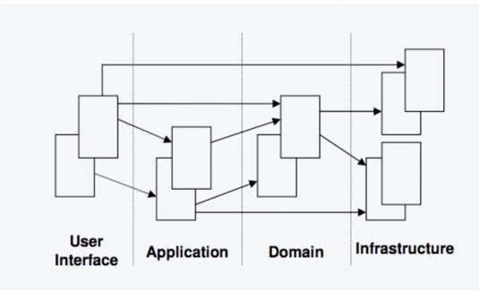
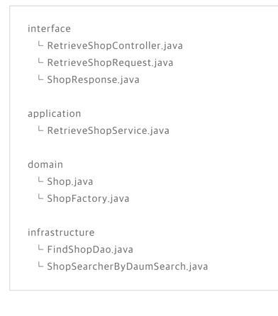
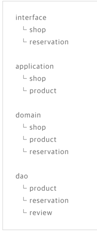
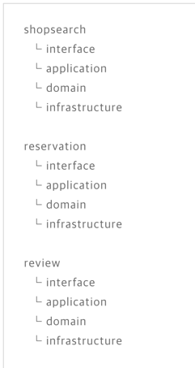

# DDD 설계

## Domain의 정확한 의미가 뭘까

도메인은 소프트웨어가 해결하려는 문제의 영역을 의미. 즉, 특정 비즈니스나 조직이 다루는 핵심 개념과 로직을 포함하는 분야

예를들면, 온라인 쇼핑몰을 개발한다고 가정하면, 해당 도메인은 다음과 같이 정의될 수 있습니다.

- 주문(Order)
- 결제(Payment)
- 배송(Delivery)
- 재고 관리(Inventory)
- 사용자 계정(User Account)
이러한 개념과 관련된 비즈니스 규칙과 로직이 포함된 영역이 바로 도메인.


### 도메인이 중요한 이유
- 비즈니스 요구 사항을 직접 반영: 소프트웨어가 비즈니스 목표를 정확히 반영하도록 설계
- 명확한 경계 설정: 도메인을 나누어 복잡성을 줄이고 모듈화 가능
- 코드의 유지보수성 향상: 도메인 모델이 명확하면 코드의 가독성과 확장성이 높아짐


### DDD 설계를 왜할까?
비즈니스의 핵심 개념을 정확히 반영하고, 유지보수성과 확장성이 뛰어난 소프트웨어를 만들기 위해서
-> Loosed Coupling & High Cohesion

- 비즈니스 로직을 코드로 명확하게 표현 → 요구 사항 변경 시 수정이 쉬움
- 도메인의 경계를 명확히 구분(Bounded Context) → 팀 간 협업이 원활
  - Entity, Value Object, Aggregate, Domain Service 등의 개념을 통해 책임을 명확히 구분하여 코드가 유지보수하기 쉽도록 설계
- 코드의 유지보수성과 확장성 증가 → 코드 복잡도가 낮아짐
- 비즈니스 전문가와 개발자가 같은 언어를 사용(유비쿼터스 언어) → 커뮤니케이션 비용 절감
- 성능 최적화가 가능하면서도 도메인 로직 중심으로 개발 → 장기적인 코드 품질 유지
  - 성능 최적화를 위해 복잡한 SQL 쿼리를 만들다 보면 비즈니스 로직이 데이터베이스에 숨겨지는 문제가 발생 ->
    DDD는 객체지향적인 도메인 모델을 우선적으로 설계하고, 성능 문제는 CQRS(Command Query Responsibility Segregation)와 같은 패턴을 적용하여 해결하는 방식을 사용.

## DDD 설계에 대해

### 도메인 지식 쌓기
도메인 ( 서비스 ) 에 대한 충분한 이해가 있어야 가능 / 비즈니스 기획, 운영 등과 충분한 커뮤니케이션이 필수

### Ubiquitous Language
비즈니스 관련 요구사항을 전달하는 주체와 보편적인 의사소통이 곧 빠른 이해와 개발의 가능성 on

### Domain Model
몇 가지 도메인 모델이 존재한다. Entity, Value Object, Aggregate, Service, Repository, Factory 등이 해당한다.

- Entity : 존재간에 구별할 수 있는 모델( 식별 자 존재 )
- Value Object : 식별자가 필요 없는 고유 모델, 도메인 모델에서 비즈니스 개념을 표현하는 불변(Immutable) 객체, 비즈니스 로직을 포함할 수 있음
- Dto : DTO는 계층 간 데이터 전송을 위한 객체로, 주로 컨트롤러와 서비스 계층에서 데이터를 전달하는 역할
- Aggregate : 생명주기가 같은 모델을 모은 root 모델 -> jpa의 lazy loading을 사용하면 굳이 필요하지 않을 수 있다
- Service : 도메인 간의 연산을 처리하는 모델
- Repository : 모델을 저장하는 곳
- Factory: Entity나 Aggregate를 생성하는 모델


## Layered Architecture
layer별로 서비스를 분리한다면 User Interface, Application, Domain, Infrastructure로 구분 할 수 있다.

- User Interface : 사용자의 요청을 하위 레이어로 전달
- Application : 복잡한 비즈니스 로직 처리
- Domain : 도메인에 대한 정보, 객체의 상태, 도메인의 비즈니스 로직을 제공하는 레이어
- Infrastructure : 영속성을 구현하거나 외부와 통신하는 기능을 제공

각 레이어는 하위 레이어를 의존하지만 User Interface는 모든 하위 레이어를 의존 할 수 있지만 반대로 Infrastructure는 다른 레이어를 의존 할 수 없다


### 그래서 어떤식으로 썼을까?? ( ex 카카오 헤어샵 )
#### 1. User Interface -> mvc 패턴의 @Controller 정리
- 응답 객체를 Cache 하는 단순 용도로만 사용하는 service는 @Component로 구현

#### 2. Application -> Domain을 조합하거나 복잡한 로직이 있는 @Service구현

#### 3. Domain -> JPA의 @Entity / Entity를 빌드하는 Factory가 존재

#### 4. Infrastructure -> @Repository, 영속성을 구현한 Dao와 외부와 통신하는 @Component가 존재
- *DAO는 데이터베이스 접근을 위한 객체, DTO는 데이터를 전달하는 객체
- @Component 외부 API, 데이터베이스, 메시지 큐, 파일 시스템 등과 통신하는 클래스




## Bouned Context
- 대규모 프로젝트에서는 시스템을 각각의 콘텍스트로 분리한다 -> 그래야 병렬개발이 가능

 --> 


## 그럼 Dto는 어디에..?
```
📂 프로젝트 구조 (예제)
└── src
    ├── application  (✅ DTO가 정의되는 위치)
    │   ├── service
    │   │   ├── OrderService.java
    │   │   ├── UserService.java
    │   ├── dto
    │   │   ├── OrderDTO.java   ✅
    │   │   ├── UserDTO.java    ✅
    ├── domain  (❌ DTO를 정의하지 않음)
    │   ├── model
    │   │   ├── Order.java
    │   │   ├── OrderItem.java
    │   ├── repository
    │   │   ├── OrderRepository.java
    ├── infrastructure
    ├── presentation  (✅ Controller에서 사용)
    │   ├── OrderController.java

```

- DTO는 Application Layer(애플리케이션 계층)에 위치
- Controller에서 사용되며, Service에서 데이터를 주고받을 때 사용
- Domain Layer(도메인 계층)에 DTO를 두지 않음


## Factory에 대해 조금 더
Factory는 객체 생성을 캡슐화하는 패턴으로, 복잡한 객체를 생성할 때 일관성을 유지할 수 있도록 도와줍니다.
특히 애그리게이트(Aggregate) 루트(Entity)를 생성하는 경우에는 Factory 패턴을 적용하는 것이 유용합니다.
### Factory를 사용하는 것이 좋은 경우

- Entity의 생성 과정이 복잡한 경우 (여러 개의 객체가 조합되어 생성될 때)
- 객체 생성의 일관성이 필요할 때
- 생성 로직을 한 곳에서 관리하고 싶을 때
- 애그리게이트 내부의 불변성을 유지하면서 생성해야 할 때

### Factory가 필요하지 않은 경우

- 생성 로직이 간단한 경우 (단순한 엔티티 생성은 생성자 사용 가능)
- 객체 생성 후 수정이 많을 경우