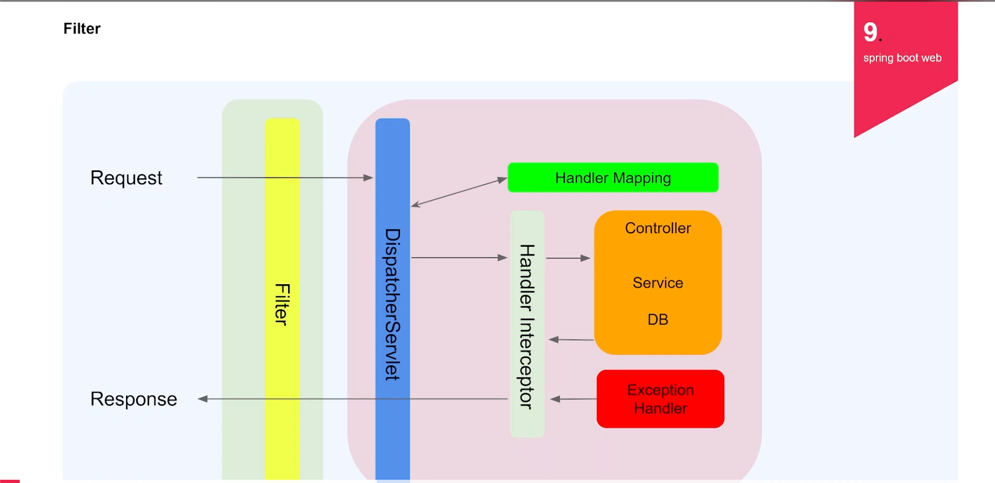

# Spring Boot
Spring Boot는 단순히 실행되며, 프로덕션 제품 수준의 스프링 기반 어플리케이션을 쉽게 만들 수 있음
Spring Boot 어플리케이션에는 Spring 구정이 거의 필요 하지 않음
Spring Boot java -jar로 실행하는 Java 어플리케이션을 만들 수 있음

주요 목표
- Spring 개발에 대해 빠르고 광범위하게 적용할 수 있는 환경
- 기본값 설정이 있지만 바꿀 수 있음
- 대규모 프로젝트에 공통적인 비 기능 제공 ( 보안, 모니터링 )
- XML 구성 요구사항이 없음

빌드 툴은 Maven, Gradle 이 존재

Servlet Container가 필요 - Tomcat, Jetty, Undertow

1. 어플리케이션 개발에 필수 요소들만 모아둠
2. 간단한 설정으로 개발 및 커스텀 가능
3. 간단하고, 빠르게 어플리케이션 실행 및 배포가 가능
4. 대규모프로젝트에 필요한 비 기능적 기능 제공
5. 오랜 경험에서 나오는 안정적인 운영 가능
6. Spring에서 불편한 설정이 없어짐 (XML 세팅 등)

# Spring Web
Spring 프레임워크에서 제공하는 웹 애플리케이션 개발을 위한 모듈입니다.
Spring MVC를 기반으로 하며, 웹 개발을 위한 컨트롤러, 서비스, 뷰 등을 쉽게 구성할 수 있도록 지원합니다.
REST API 개발을 위해 Spring Web + Spring Boot 조합이 많이 사용됩니다.

### Validation
model를 세팅할 때 유효성 검증하는 어노테이션을 추가하여 controller에서 요청 req object에 @Valid 어노테이션을 통해 각각 model에서 걸어놓은 유효성 검증 절차를 밟게함

- 사용 이유
1. 유효성 검증하는 코드의 길이가 너무 길다.
2. service logic에 대해 방해
3. 흩어져 있는 경우 어디서 검증 되었는지 찾기 힘듬
4. 검증 로직이 변경되는 경우 테스트 코드 등, 전체 로직이 흔들릴 수 있음

- 종류

||||
|----|----|----|
|@Size|문자 길이 측정| int Type 불가|
|@NotNull|null불가||
|@NotEmpty|null, ""불가||
|@NotBlank|null, ""불가, " " 불가||
|@Pattern|정규식 적용||
|@Max|최대값||
|@Min|최소값||
|@AssertTrue / False|별도 Logic적용||
|@Valid | 해당 object validation 실행||
|@AssertTrue / False|별도 Logic적용||
|@Past|과거 날짜||
|@PastOrPresent|오늘이거나 과거||
|@Future|미래 날짜||
|@FutureOrPresent|오늘이거나 미래||

## Memory Database
DataBase : 데이터의 저장소
DBMS ( DataBase Management System ): 데이터 베이스를 운영하고 관리하는 소프트웨어

### Repository
데이터가 저장되는 저장소와 연결되는 인터페이스 

Repository는 데이터베이스(DB)와 애플리케이션 비즈니스 로직 사이에서 데이터를 관리하는 계층입니다.
즉, 데이터베이스와 직접 상호작용하는 객체이며, CRUD(Create, Read, Update, Delete) 작업을 추상화하여 처리합니다.

### Filter
- Request로부터 들어온 가장 날 것의 데이터가 존재
- 들어온 데이터를 다른 데이터로 변환 한다던지, JSON body에 대해서 모든 내용을 기록한다던지하는 log 시스템 활용

### Handler Interceptor
- spirng에서 관리하는 bean
- 이미 handler mapping을 통해 어디로 가야할지 알고 있기 때문에 해당 컨트롤러가 가지고 있는 어노테이션을 찾아서 무언가 작동을 한다던지, 헤더에 있는 내용을 보고 권한 검사를 한다던지 주로 인증관련 로직을 많이 함

