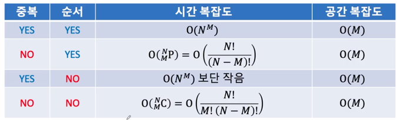

# 완전 탐색
### 문제를 해결하기 위해 확인해야 하는 모든 경우를 전부 탐색하는 방법
### 백 트래킹을 통해야하는 상황 해결

- N 개중 1) 중복을 허용해서 2) 중복 없이 M개를 1) 순서 있게 내열하기 2) 고르기
- 함수의 정의가 50%

  

```
// Recurrence Function ( 재귀 함수 )
// 만약 M 개를 전부 고름 => 조건의 맞는 탐색을 한 가지 성공
// 아직 M 개를 고르지 않음 => k 번째부터 M번째 원소를 조건에 맞게 고르는 모든 방법을 시도
static void rec_func(int k ) {}

public static void main(String[] args) {
    input();
    // 1 번째 원소부터 M 번째 원소를 조건에 맞게 고르는 모든 방법을 탐색해줘
    rec_func(1);
    System.out.println(sb.toString());
```
